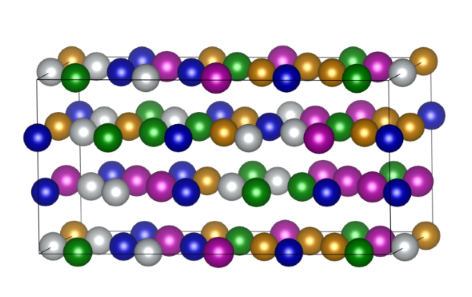

# HEA VASP input generation

## Table of Contents
- [Abstract](#abstract)
- [How to Use](#how-to-use)
- [The Code Structure](#the-code-structure)
- [Results](#results)

## Abstract
High entropy alloys (HEAs) are loosely defined as solid solution alloys that contain more than five principal elements in equal or nearly equal atomic percent (at.%). Here we consider the Cantor Alloy, CoCrFeMnNi, with a single fcc-phase. The unit cell has dimensions of (x, y, z) = (5x4x3), meaning that it is composed of 3 planes along the z-axis, each containing 20 atoms, for a total of 60 atoms. Since the elements Cr, Mn, Fe, Co, and Ni have the same concentration, there are 12 atoms for each element in the unit cell.  

This code generates random configurations of the bulk-fcc unit cell by permuting the positions of different element atoms in the lattice. A new configuration is saved in a `npy file` input but the user only if it is not equivalent to the ones already saved. If the configuration is equivalent to any existing configuration, the code generates another configuration until a non-equivalent one is found. Two configurations are considered equivalent if their unit cells, when periodically repeated in 3D space, generate the same lattice.

Each time the code is executed, it creates the input files: `INCAR`, `POSCAR`, `POTCAR`, and `KPOINTS` for VASP (Vienna Ab initio Simulation Package) relaxation calculations of the new configuration.

## How to Use
1. **Download and Installation:**
   - First, download the `.zip` folder containing the code.
   - Install the required Python libraries: `numpy` and `python-ase`. You can install these packages using pip:
     ```
     pip install numpy ase
     ```
     Alternatively, if you are using a conda environment, use:
     ```
     conda install numpy ase
     ```

2. **Configuration:**
    - Modify the paths in the `paths.json` file:
     - `settings`, path of the json of file containing the input paramters
     - `saved`, path of the npy variable where generated configurations are saved
     - `seed`, random seed 
     - `conf`, path where the folders containing the input files (POSCAR, KPOINTS, POTCAR, INCAR) will be saved

    - Modify the input parameters by modifying the json file of `settings.json`:
     - `alat`, lattice parameter
     - `incar_settings`, incar setting
     - `kpoints_settings`, kpoints settings
     - `pseudo_setup`, pseudopotentials setup

3. **Execution:**
   - Run the main script by executing the following command:
     ```
     python main.py
     ```

## The Code Structure
The code is organized into the following components:

- **`main.py`:** The core script that calls the necessary functions to generate a new configuration, saves it if it is inequivalent, and outputs the input files.
- **`functions.py`:** Contains all the functions that are used by `main.py`.
- **`tests/`:** A folder containing tests for the functions present in `functions.py` and the json file `settings_tests.json` containing the input parameters used to run the tests.

     To run a test, use the command:
     ```
     python -m unittest tests/file_name.py
     ```
- **`settings.json/`:** A dictionary of the parameters that the user can modify: lattice parameter (alat) and INCAR, KPOINTS, and pseudopotentials settings.
- **`paths.json/`:** A json file containing paths and the random seed that the user can modify.
- **`ase_pseudo/`:** A folder containing the pseudopotentials stored in POTCAR files for each element, necessary for writing VASP input files.

## Results
The output of the code is a folder named `conf_n`, where `n` is the nth configuration generated. This folder contains the following input files:

- `POSCAR`
- `POTCAR`
- `KPOINTS`
- `INCAR`

The `POTCAR` file contains information on the geometry of the system, and it can be visualized using VESTA, a 3D visualization program for structural models, volumetric data such as electron/nuclear densities, and crystal morphologies.

Here is an example of visualization of a generated unit cell.

